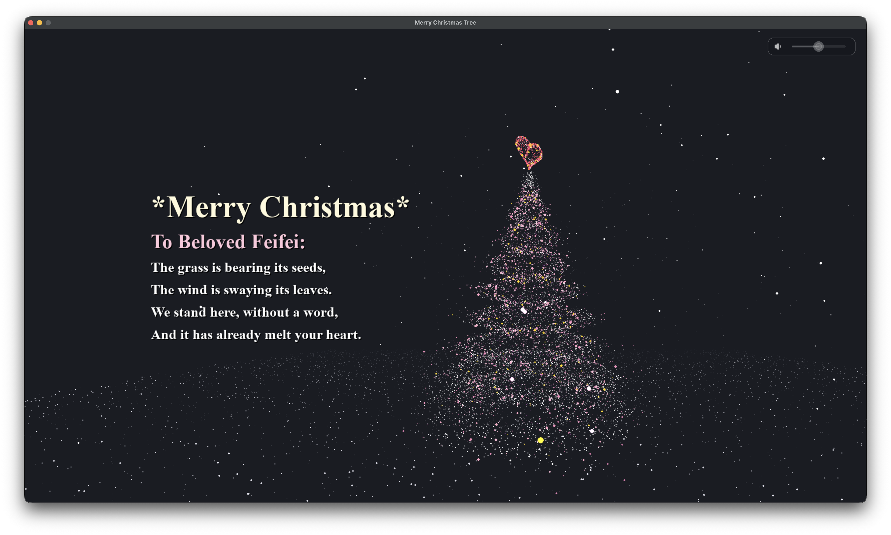

# Christmas Tree 粒子圣诞树



借助 PyGame 粒子系统实时渲染的 3D 圣诞树，包含心形顶饰、雪地、飘落雪花与可调音量的背景音乐。应用支持全屏、宽高比自适应，以及 Windows 屏幕保护程序模式，适合作为节日贺卡或静态展示。

## ✨ 功能亮点
- 多层粒子堆叠的圣诞树造型，自动旋转并支持鼠标拖拽调整视角
- 树顶 3D 心形装饰、环形雪地及多级雾化效果，营造立体感
- 漂浮雪花与动态闪烁粒子带来温暖的节奏感
- 内置多行留言与背景音乐，右上角滑块可调节／静音
- Windows 额外提供屏保包装器（`screensaver.py`）以生成 `.scr`

## 环境要求
- Python 3.9+
- `pip install -r requirements.txt`（包含 `pygame`、`pyinstaller`、`cairosvg`）
- 运行时需可播放音频（默认 `music.mp3`）

## 快速运行
```bash
# 1. 安装依赖
python -m venv .venv
source .venv/bin/activate        # Windows 使用 .venv\Scripts\activate
pip install -r requirements.txt

# 2. 启动程序
python main.py                   # 或 py main.py
```

### 开发循环（macOS/Linux）
`dev.sh` 会自动激活虚拟环境、检查依赖并在退出后等待重新运行：
```bash
chmod +x dev.sh
./dev.sh
```

## 交互方式
- 鼠标左键拖拽：旋转圣诞树
- 鼠标移动：调节右上角音量滑块，点击喇叭图标静音
- `ESC` 或关闭窗口：退出程序

## 配置与自定义
核心配置集中在 `main.py` 中的 `Config` 类，可修改：
- `MESSAGE_LINES` / `TEXT_POSITION_*`：祝福语及排版
- `TREE_PARTICLES`、`SNOW_PARTICLES` 等：粒子数量与性能平衡
- `AUTO_FULLSCREEN`、`VIRTUAL_WIDTH`：启动模式与渲染分辨率
- `MUSIC_FILE`、`DEFAULT_VOLUME`：背景音乐路径及默认音量

修改配置后重新运行或重新打包即可看到新效果。

## 部署方法
根据目标系统选择以下方式，将包含资源的目录整体拷贝到目标机器即可运行：

- **macOS / Linux（Python 环境）**  
  直接复制项目或打包产物，在目标机器激活虚拟环境后执行 `python main.py`。若希望开机即展示，可结合系统的登录项自动运行。

- **Windows（Python 环境）**  
  复制项目并运行 `py main.py`。若要部署屏保版本，可使用后文的打包脚本并双击 `.scr` 安装。

- **只分发可执行文件**  
  请使用下节“打包方法”生成平台原生产物，将 `dist` 下的完整目录（或 `.app`）交付即可，无需再安装 Python。

## 打包方法
本项目使用统一的 `build.spec`，脚本会复制 `pygame` 与 `music.mp3` 以获得独立分发目录。运行脚本前请确保虚拟环境已激活并安装依赖。

### macOS / Linux
```bash
chmod +x build.sh
./build.sh
```
- macOS 输出：`dist/Christmas_Tree.app`
- Linux 输出：`dist/Christmas_Tree/Christmas_Tree`

### Windows
在命令提示符运行：
```bat
build.bat
```
菜单提供三种操作：
1. 生成普通可执行文件（`dist/Christmas_Tree/Christmas_Tree.exe`）  
2. 生成屏保（`dist/Christmas_Tree_Screensaver/Christmas_Tree.scr`）  
3. 清理 build/dist

如需直接使用 PyInstaller，也可执行：
```bash
pyinstaller build.spec          # 普通应用
pyinstaller build.spec --screensaver   # Windows 屏保
```

## 项目结构
```
.
├── main.py                # 粒子动画主体与配置
├── screensaver.py         # Windows 屏保入口
├── music.mp3              # 默认背景音乐
├── icon.ico / icon.icns   # 应用图标
├── requirements.txt       # Python 依赖
├── build.sh / build.bat   # 平台打包脚本
├── build.spec             # PyInstaller 配置
├── dev.sh                 # 开发循环脚本（macOS/Linux）
└── dist/, build/          # 打包输出目录
```

## 常见问题
- **窗口比例异常**：设定 `Config.MAINTAIN_ASPECT_RATIO = True` 可保持 16:9，或关闭以填充屏幕。  
- **音乐未播放**：确认 `music.mp3` 位于同级目录，且系统输出设备可用。  
- **打包失败**：确保在虚拟环境内运行，且 `pyinstaller` 版本与 Python 匹配；若生成屏保，需在 Windows 上执行。
- **音量图标仍是旧样式**：确认 `cairosvg` 已安装并与 `icons/` 目录一起打包，缺失时程序会退回内置图标。

祝你打造出独一无二的圣诞祝福！ 🎄
